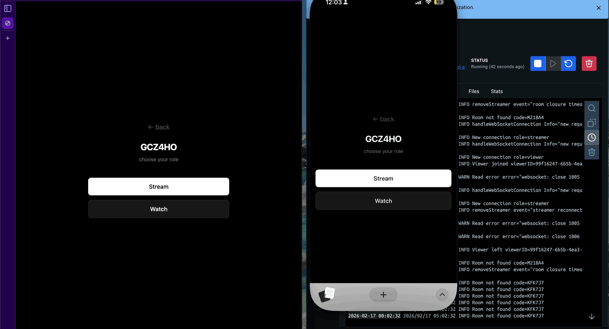

# LocalStream

A real time screen sharing web app built from scratch with WebRTC and WebSockets. Does not use any third party streaming services, or the cloud, just P2P video over the local network.
## Demo

## Why I built this

I wanted to learn something new. I've had experience with HTTP calls and REST APIs but not with WebSockets or WebRTC. Before building this I did not even know what happens on apps such as Discord when you share your screen.

I started with 1 streamer 1 viewer as a way to build my knowledge and after that turned it into what it is now.

## Features

- Real time screen sharing through WebRTC
- Room based access with 6-character code
- Automatic reconnection handling
- Room management
- Streamer and viewer notifications


## Architecture


The Go server is only used for signaling it does not touch any of the media data, that is done through WebRTC after a connection is established.

### Data Flow

- **Signaling (via WebSocket)**: Streamer ↔ Go Server ↔ Viewers
  - WebRTC offers/answers
  - ICE candidates
  - Room management messages

- **Media (via WebRTC P2P)**: Streamer ↔ Viewer (Direct)
  - Screen capture stream
  - No server relay

### WebSocket Protocol Flow

1. Handshake: Client upgrades HTTP to WS with room code and role params.
2. Signaling: Streamer generates a WebRTC offer, Go signal server broadcasts to the viewer(s) in the room.
3. ICE Negotiation: Peers exchange network candidates through the Go server.
4. Heartbeat: Server manages connections. If streamer disconnects room gets deleted in 30 seconds, reconnection stops the countdown.

## Go - Backend

All the code for the Go server is in main.go, this file handles:

- Room management: Rooms are map structures and all operations are thread safe through the use of RWMutex, and Mutex for each connection.
- Connection upgrade: HTTP requests are upgraded to WS and each connection is wrapped in a SafeConn wrapper to allow for mutual exclusion lock.
- Streamer management: Manages streamers for a given room and also handles streamer drops and reconnects.
- Automatic room clean up: Empty rooms after 5 minutes are deleted through server-side operations.
- REST API: For deleting rooms, and checks for rooms and streamer.
- Logging: Logs all errors and information.

Future Refactor: split main.go into separate packages for room management, viewer and streamer management, and API routes.

### Testing

This file tests room cycles, room creation and deletion, viewer cycles and streamer joins.

- **main_test.go**: test file to make sure main.go is functional.

## Next.js + React - Frontend

- **StreamerView**: All logic for the streamer. Captures screen using getDisplayMedia() function, creates one RTCPeerConnection per viewer.

- **ViewerView**: Displays the stream, receives offers and sends answers.

- **useWebSocketConnection**: Hook for establishing a WebSocket connection to a server. Handles open, close, error, and message events. Has a 3 attempt reconnection logic.

- **useRoomHealthCheck**: Polls the server every 10 seconds to make sure a room is active. If room is not active, triggers a modal to let the viewers and streamer know.

## Challenges:

The biggest challenge was understanding the WebRTC negotiation flow. It was the first time I had heard of offers, answers, and ICE candidate exchange. I had to study this protocol and first build simple 1-to-1 connections to understand the process.

Scaling from 1-to-1 to 1-to-many required redesigning the backend's concurrency model. This is where I had to use RWMutexes to prevent race conditions and wrap each WebSocket connection in the SafeConn wrapper to prevent concurrent writes.

## Decisions and Tradeoffs

STUN vs TURN server: Since this was supposed to be a "local" project I did not think paying for a TURN server was a good idea. I just needed a way for the clients to discover their public IP to establish a connection. If I decide to make this work outside the NAT, I will consider switching.

Why WebSocket and WebRTC: I needed a Bi-directional channel for signaling and I also wanted to work with WebSockets. WebRTC for media sharing.

One peer connection per viewer: For a handful of viewers locally it is a good decision, though a burden on the streamer's hardware. This allows for it to be true P2P, low latency, and the server never sees the data.

## Known Limitations

- Based on testing, a streamer can reliably support ~5 concurrent viewers with active screen sharing, or 10+ viewers when idle (no screen share active)
- Trying to access the URL with a VPN causes issues.
- Mobile browsers don't support screen capture (getDisplayMedia not available)
- Requires HTTPS even on local network for browser security requirements

## What I Learned

- WebRTC peer connection lifecycle and signaling protocols.
- Go concurrency patterns (RWMutex for shared state, Mutex for connection safety).
- WebSocket connection management and upgrades
- Browser security requirements (HTTPS for getDisplayMedia).
- P2P architecture tradeoffs.

## Getting Started

### Prerequisites:

- Go 1.21+
- Node.js 18+
- npm

### Generating Certificates

HTTPS is required for screen sharing to work on devices other than localhost. Self-signed certificates are included in the repo, but if you need to regenerate them:

```bash
openssl req -x509 -newkey rsa:2048 -keyout key.pem -out cert.pem \
  -days 3650 -nodes -subj "/CN=localstream"
cp key.pem cert.pem server/
cp key.pem cert.pem web/
```

### Docker Deployment

I recommend deploying it using docker:

```bash
docker compose up -d --build
```

Access from any device on the network at `https://<your-local-ip>:3000`.
You can get your local ip by doing:

```bash
MacOS: ifconfig | grep "inet "

Windows(powershell): ipconfig | Select-String "IPv4"
Windows(cmd): ipconfig | findstr "IPv4"
```

On first visit, your browser will show a certificate warning — please accept it. You will also need to accept the certificate for the backend by visiting `https://<your-local-ip>:8080` once.

### Manual Setup

1. Start backend

```bash
cd server
go mod download
go run main.go # running on https://localhost:8080 and https://<your-local-ip>:8080
```

2. Start frontend

```bash
cd web
npm install
npm run dev:https # running on https://localhost:3000 and https://<your-local-ip>:3000
```

Access from any device on the network at `https://<your-local-ip>:3000`. Accept the certificate warning for both `:3000` and `:8080` on each device.
